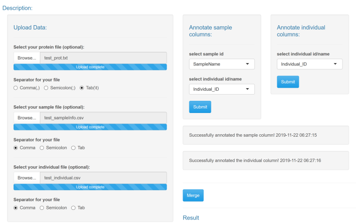
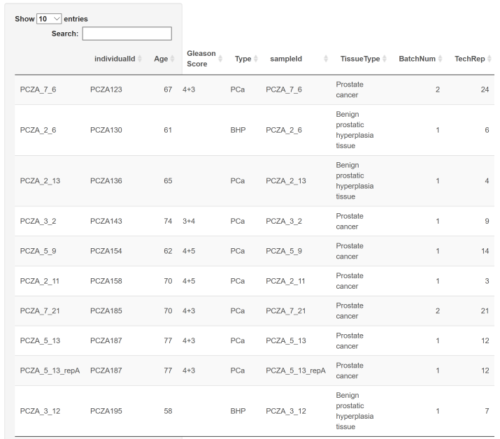

# ProteomeExpert-Data Upload

## Parameters

### Data Upload
Data Upload is the core data input interface for user to upload your own data file through web interface. The data Upload allows uploading your specific protein matrix and experiment meta-data (including experiment run sample file and individual file) as the input data for most of modules. And much more, it interactively merges the sample and individual information into one file which is required by some modules such as statistics, data mining, data pre-processing etc.
Upload your files (`protein`, `sample`, `individual`) .txt or .csv format with the bottom Browse . Choose separator for the file according to its format. `Comma` for .csv, `Semicolon`  ,   `Comma`  or   `Tab`   for .txt. file. Select `sample id` (protein file should have the same sample id as sample file) columns for further analysis,  `individual id/name` in sample file and individual file as reference for data merge. This tool will merge multiple files  as template for further analysis.

## Tutorial

1. Download the prot, sample and individual test data Download _test_prot.txt_, _test_sample.csv_ and _test_individual.csv_ files from "Online Help - Test data files used for batch design - Get", _test_individual.csv_ files comprise 21 individual information, _test_sample.csv _contain individual and sample information. All of the test data are from Delayed post-hypoxic leukoencephalopathy (DPHL) dataset. 
2. Select your protein file: click on the  `Browse..` to upload the _test_prot.txt_ file, choose `Tab` as separator.
3. Select your sample file: click on the  `Browse..` to upload the _sample_individual.csv_, choose `Comma` as separator.
4. Select your individual file click on the  `Browse..` to upload the _individual_prot.txt_ file, choose `Comma` as separator.
5. Annotate sample columns: select `SampleName` as sample id; select `Individual_ID` as individual id/name, click on `Submit` .
6. Annotate individual columns: select `Individual_ID` as individual id/name, click on `Submit` .

	

7. Click on `Merge` , result would be shown on the bottom on the page. After merge, all the data uploaded would save in the sever for further analysis.

	

