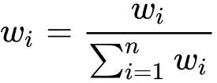
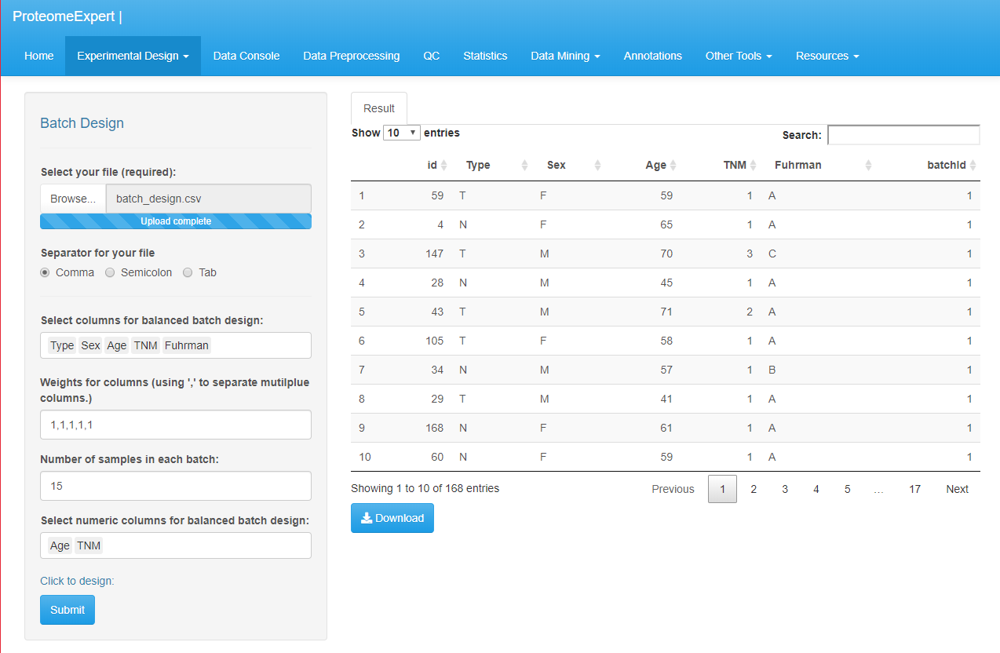

# ProteomeExpert Experimental Design

## Overview

 ProteomeExpert is a web server-based tool that offers multiple convenient tools for large cohort
experimental design as well as mining, interpretation and visualization of big
proteomic data sets. This online platform integrates machine learning methods, statistics,
data annotation, missing value treatment, data interactive and exploratory
tools.  
 The ProteomeExpert web server address above issues
and is hosted within R shiny environment under a Linux system in docker
available as a web server. It incorporate the characteristics of
the-state-of-art existing tools as well as addressing more issues that
particular important for clinical analysis on large sample cohort. The dynamic
and interactive data visualization web browser interfaces provide users with a
highly intuitive interface for manipulating the tool and viewing the analysis
results.

The analysis approach described by Guo et al[1].The source code is also openly available at
https://github.com/lifeinfo/proteomeExpert.

It executes the following processes:

- Experimental Design : Power Analysis & Batch Design
- Data Console
- Data Preprocessing 
- QC : Missing Value & Pearson Correlation
- Statistics : t-test & VocanoPlot & ViolinPlot & RadarMap
- Data Mining : Feature Selection & Clustering & Classification
- Annotations
- Other Tools : Peptide to protein & PulseDIA preprocess

## Parameters
### Experimental Design : Power Analysis

Power analysis is a statistical device that allows us to determine the sample size required to detect a preset effect under a given test statistics, such as Chi-square test or t-test. In particular, here we need pay attention to the calculated sample size and the realized sample size in an experiment. As observed empirically, when the expression of a protein is not that high, say less than 17 after log2 scale transformation, the required sample size will be compromised due to missing data and the statistical power is compromised too.

Power analysis, set parameters: `Number of Proteins (default=5000)` is the estimated number of proteins identified of your dataset.  `Mean abundance (default=13)` is the average intensity (take log2)of proteins in the experimental group.  `Mean abundance 0 (default=13.5)` is the average intensity (take log2)of proteins in the control group. `Alpha (default=0.05)` is the significance level of the test (the _P_ value).  `Beta (default=0.2)` is the
probability of accepting the null hypothesis even though the null hypothesis is false (i.e. false negative),
when the real difference is equal to the minimum effect size. Beta = 1 - power. `Standard
deviations (default=0.75)` have to be estimated for measured variables, usually we assumed it equals to the standard deviation for controlling data.  Click on the `Submit` and the estimated sample size and figure will be shown on the right of window. 

### Experimental Design : Batch Design
Because the large scale experiments cannot be done all at once, the main purpose for batch design is to allocate samples into balanced groups to avoid bringing technical bias into experiment.  Upload your sample data matrix in **.txt** or **.csv** format with the bottom `Browse`. Choose separator for the file according to its format. `Comma` for .csv, `Semicolon` ,  `Comma` or  `Tab`  for .txt. file. `Select columns for balanced batch design` means choosing the column names (attributes) of your sample dataset that need to be balanced. `Weights for columns` is the different weights between different attributes when the influencers  are considered together.  For example, if you submit `1,1,2` as input for selected columns A, B, C. This means the weight of column A is 25%, of column B is 25% and of column C is 50%. Normalize with , n is the number of attributes. `Number of samples in each batch` means how many samples you expected in each balanced group. `Select numeric columns for balanced batch design` means if the attribute is numeric type, such as Age, Tumor Node, Metastasis and so on, it needed to be clarified.

## Tutorial 

1. Download the Batch Design test data 

    For this demo, we will be using a Delayed post-hypoxic leukoencephalopathy (not published) dataset, comprised of 168 samples' information, along with characters of "Sample id", "Type", "Sex", "Age", "TNM" and "Fuhrman". Download the _batchdesign.csv_ file from "Online Help - Test data files used for batch design - Get"
	
2. Click on `Browse..` to upload the _batch_design.csv_ file, choose `Comma` as separator.
3. Select "Type", "Sex", "Age", "TNM" and "Fuhrman" for balanced batch design.
4. Input weights "1,1,1,1,1" for "Type", "Sex", "Age", "TNM" and "Fuhrman".
5. Input "15" as number of samples in each batch.
6. Select "Age" and "TNM" as numeric columns for balance batch design.
7. Click on `Submit` ,waiting for the result that would be shown on the right side. batchId shows divided group number.

    
	
8. Click on Download to get the _BatchDesignResult.txt_ file.

[1] ProteomeExpert:
a web-server platform for exploring, modeling, visualizing, and mining big
proteomics data [2] Lynch Michael, Walsh Bruce. 1998. Genetics and Analysis of Quantitative Traits. Sunderland, Mass.: Sinauer Assoc
