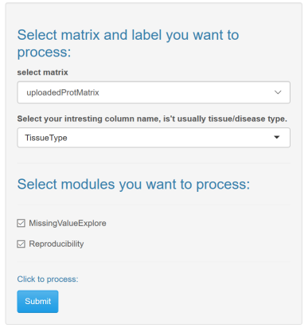
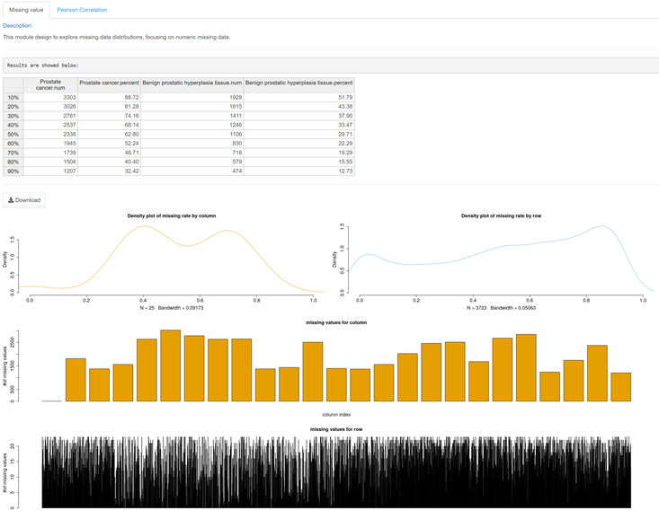

# ProteomeExpert-Quality Control

## Parameters
### Quality Control (QC)

'QC' allow to show the quality of your protein matrix that measured by missing value ratio and reproducibility (Pearson Correlation). The objective protein matrix data is required to be uploaded in the step of 'Data Console - select your protein file' before starting this step. `Select matrix` select uploadedProMatrix as the matrix to be analyzed, and `Select your interesting column name` as your interesting attribute which will count the number of proteins hierarchy according to the non missing ratio of each protein. Then choose `MissingValueExplore` and `Reproducibility` as the modules you want to process.
`MissValueExplore` module design to explore missing data distributions, focusing on numeric missing data. The report shows missing data distributions in different tissue/disease types and show distributions in each row (proteins) and each column (samples).
`Reproducibility` module is designed to explore correlations between each sample by Pearson Correlation.

## Tutorial

1. Select `uploadedProMatrix` as the matrix to be analyzed.
2. Select `MissValueExplore` and `Reproducibility` as modules you want to process. click on `Submit`, results would be shown on the right side on the page.

The screenshot of reproducibility

