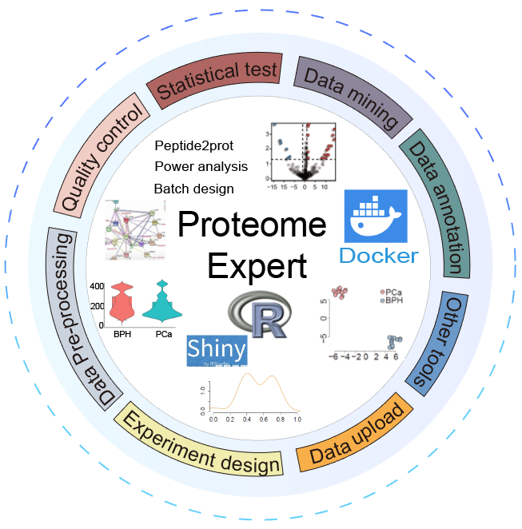

&nbsp;

#####  Welcome to ProteomeExpert, which is a user friendly web server wrapped by [`R/Shiny`](http://shiny.rstudio.com) for quantitative proteomics data analysis.To analyze large-scale proteomic data sets more efficiently and conveniently, we present a web server-based software tool ProteomeExpert implemented in Docker, which offers various analysis tools for experimental design, data mining, interpretation, and visualization of big proteomic data set. 

&nbsp;

##### 