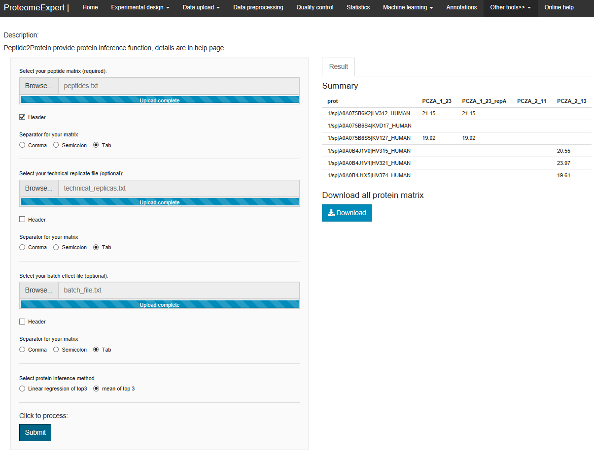

# ProteomeExpert-Other tools

## Overview
This module provides some optional tools which may be used in quantitative proteomics data analysis. Currently only peptide to protein function is available.
 

## Procedure
	1.Prepare the peptide matrix, where each row represents a peptide and each column represents a sample.
	2.Log2 -transform the precursor intensities.
	3.perform quantile normalization across all samples via the normalize.quantiles function from Bioconductor R library preprocessCore.
	4.Technical imputation, using technical replica to substitute NAs in each other. 
	5.Batch correction based on user defined batch using the R package Combat. 
	6.Calculate the mean expression of each row to rank the peptide precursor intensity.
	7.Order peptide precursors in protein group, first by number of NAs (Intensity equal to 0, ascending) and then by the mean expression (descending)
	8.Keep no more than top 3 precursors (# of NAs ascending and order by mean expression descending) for each protein group. 
	9.To impute some missing values at protein level for some sample from multiple peptides quantified, we built linear model for step 8 matrix, always use the top protein groups as dependent variable (γ) and chose values greater than 0 as multiple independent variables (χ) by decreasing order of priority. Moreover, impute y using a linear combination of X. Only the regression coefficient with P value<=0.05 and R2 > 0.36 were accepted and rounded up to two decimal places. Then we used the intensity value from the top1 peptide precursor to represent the protein intensity. We apply lm function in R to build the model and do the above imputation.  
	10.Keep the top1 precursor corresponding proteins and its' intensity. 

## Tutorial
1. Download the `peptides.txt`, `technical_replicas.txt` and `batch_file.txt` files from "Online Help - Test data files used for peptide to protein inference - Get"
2. Select your peptide file: click on the  `Browse..` to upload the _peptides.txt_ file, choose `Tab` as separator and with `Header` checkbox selected.
3. Select your technical file: click on the  `Browse..` to upload the _technical_replicas.txt_, choose `Tab` as separator.
4. Select your individual file click on the  `Browse..` to upload the _batch_file.txt_ file, choose `Tab` as separator.
5. Click `Submit` button.

